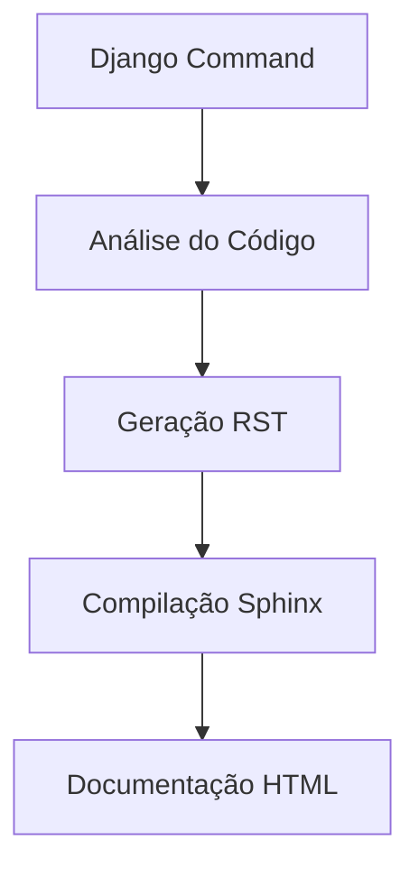

# 📚 Documentação do Nexo

Este diretório contém a documentação completa do sistema Nexo, construída com Sphinx e extensões avançadas.

## 🚀 Início Rápido

### Instalação das Dependências

```bash
# Instalar dependências de documentação
pip install -r requirements-docs.txt
```

### Gerar Documentação

```bash
# Usando comando Django (recomendado)
python manage.py gerar_documentacao --acao create --incluir-frontend --verbose

# Ou usando Makefile/Batch
make html          # Linux/macOS
make.bat html      # Windows
```

### Visualizar Documentação

```bash
# Iniciar servidor de desenvolvimento
python manage.py gerar_documentacao --acao read --servidor --port 8080

# Ou manualmente
make serve         # Linux/macOS
make.bat serve     # Windows
```

## 📖 Sistema CRUD de Documentação

O Nexo inclui um sistema completo de CRUD (Create, Read, Update, Delete) para documentação:

### CREATE - Gerar Nova Documentação

```bash
# Gera documentação completa do zero
python manage.py gerar_documentacao --acao create --incluir-frontend

# Opções disponíveis:
--formato html|pdf|epub     # Formato de saída
--incluir-frontend          # Incluir docs do frontend
--verbose                   # Saída detalhada
```

### READ - Visualizar Documentação

```bash
# Abrir no navegador
python manage.py gerar_documentacao --acao read

# Iniciar servidor local
python manage.py gerar_documentacao --acao read --servidor --port 8080
```

### UPDATE - Atualizar Documentação

```bash
# Atualização incremental
python manage.py gerar_documentacao --acao update

# Modo watch (rebuild automático)
python manage.py gerar_documentacao --acao update --watch
```

### DELETE - Limpar Documentação

```bash
# Remove arquivos de build
python manage.py gerar_documentacao --acao delete
```

## 🛠️ Funcionalidades Avançadas

### Modo Automático

```bash
# Detecta estado e age adequadamente
python manage.py gerar_documentacao --acao auto
```

### Documentação do Frontend

```bash
# Inclui análise de templates, CSS e JavaScript
python manage.py gerar_documentacao --incluir-frontend
```

### Múltiplos Formatos

```bash
# HTML (padrão)
python manage.py gerar_documentacao --formato html

# PDF
python manage.py gerar_documentacao --formato pdf

# EPUB
python manage.py gerar_documentacao --formato epub
```

## 📁 Estrutura da Documentação

```
docs/
├── index.rst                  # Página principal
├── conf.py                    # Configuração Sphinx
├── overview.rst               # Visão geral
├── installation.rst           # Guia de instalação
├── quickstart.rst            # Início rápido
├── api/                      # Documentação da API
│   ├── models.rst            # Modelos Django
│   ├── views.rst             # Views
│   ├── forms.rst             # Formulários
│   └── utils.rst             # Utilitários
├── frontend/                 # Documentação Frontend
│   ├── templates.rst         # Templates
│   ├── static.rst            # Arquivos estáticos
│   └── javascript.rst        # JavaScript
├── user-guide/               # Guia do usuário
├── admin-guide/              # Guia administrativo
├── development/              # Guia de desenvolvimento
├── examples/                 # Exemplos práticos
├── _static/                  # Arquivos estáticos
├── _templates/               # Templates customizados
└── _build/                   # Arquivos gerados
```

## ⚙️ Configuração Avançada

### Extensões Sphinx Utilizadas

- **sphinx.ext.autodoc** - Documentação automática do código
- **sphinx.ext.napoleon** - Suporte a Google/NumPy docstrings
- **sphinx.ext.viewcode** - Links para código fonte
- **sphinx_copybutton** - Botão de cópia em blocos de código
- **myst_parser** - Suporte a Markdown
- **sphinx_tabs** - Abas interativas
- **sphinx_design** - Componentes de design
- **sphinxcontrib.django** - Integração com Django

### Personalização do Tema

O tema `sphinx-book-theme` pode ser personalizado em `conf.py`:

```python
html_theme_options = {
    'repository_url': 'https://github.com/seu-usuario/nexo',
    'use_repository_button': True,
    'use_edit_page_button': True,
    'show_navbar_depth': 2,
    'announcement': 'Documentação do Nexo v1.0',
}
```

### Integração com Django

A documentação está totalmente integrada com o Django:

- Descoberta automática de modelos
- Análise de views e forms
- Geração de documentação do frontend
- Templates RST dinâmicos

## 🎨 Recursos Visuais

### Diagramas Mermaid



### Blocos de Código com Syntax Highlighting

```python
# Exemplo de uso do comando
from django.core.management import call_command

call_command('gerar_documentacao', acao='create', verbose=True)
```

### Abas Interativas

Suporte a abas para diferentes sistemas operacionais e configurações.

### Admonitions

```rst
.. note::
   Esta é uma nota informativa.

.. warning::
   Este é um aviso importante.

.. tip::
   Esta é uma dica útil.
```

## 🔧 Comandos Make Disponíveis

### Linux/macOS (Makefile)

```bash
make help           # Mostra todos os comandos
make html           # Gera HTML
make pdf            # Gera PDF
make clean          # Limpa build
make serve          # Inicia servidor
make watch          # Modo watch
make install-deps   # Instala dependências
make coverage       # Relatório de cobertura
make linkcheck      # Verifica links
make deploy         # Prepara para deploy
```

### Windows (make.bat)

```cmd
make.bat help
make.bat html
make.bat pdf
make.bat clean
make.bat serve
make.bat watch
```

## 📊 Relatórios e Métricas

### Cobertura da Documentação

```bash
# Gera relatório de cobertura
make coverage

# Ver resultados
cat _build/coverage/python.txt
```

### Verificação de Links

```bash
# Verifica links quebrados
make linkcheck

# Ver resultados
cat _build/linkcheck/output.txt
```

## 🚀 Deploy da Documentação

### GitHub Pages

```bash
# Configurar para GitHub Pages
make deploy

# Ou usando GitHub Actions (veja .github/workflows/)
```

### Servidor Personalizado

```bash
# Build para produção
make full-rebuild

# Copiar arquivos
rsync -av _build/html/ usuario@servidor:/var/www/docs/
```

## 🤝 Contribuindo com a Documentação

### Adicionando Nova Seção

1. Criar arquivo `.rst` no diretório apropriado
2. Adicionar referência no `index.rst` ou arquivo de índice relevante
3. Executar `make html` para testar
4. Fazer commit das alterações

### Documentando Novo Modelo/View

1. Adicionar docstrings adequadas no código Python
2. Executar comando para regenerar documentação automática:
   ```bash
   python manage.py gerar_documentacao --acao update
   ```

### Padrões de Documentação

- Use docstrings estilo Google/NumPy
- Adicione exemplos de código quando relevante
- Inclua links para conceitos relacionados
- Mantenha consistência no estilo

## 📞 Suporte

Para dúvidas sobre a documentação:

- 📧 Email: docs@nexo.gov.br
- 💬 Issues: GitHub Issues
- 📖 Wiki: GitHub Wiki

## 📄 Licença

A documentação segue a mesma licença MIT do projeto principal.

---

**Última atualização:** Automaticamente via comando Django  
**Versão da documentação:** 1.0.0  
**Versão do Sphinx:** 7.1.0+ 